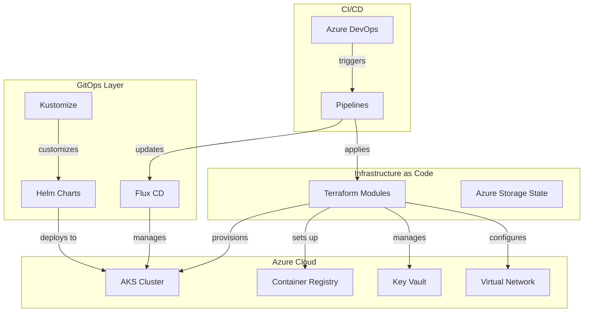
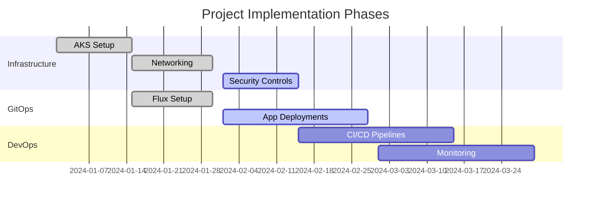

# 🚀 Azure Terraform AKS GitOps Framework

<div align="center">


[](LICENSE)
[](CONTRIBUTING.md)
[](https://www.terraform.io/)
[](https://azure.microsoft.com/)
[](https://kubernetes.io/)
[](https://fluxcd.io/)

🔥 Enterprise-grade Infrastructure as Code (IaC) framework for deploying and managing Azure Kubernetes Service (AKS) clusters using Terraform and GitOps principles.

[Getting Started](#getting-started) •
[Architecture](#architecture) •
[Features](#features) •
[Contributing](#contributing) •
[Documentation](#documentation)

</div>

## 🎯 Key Features

### 🌟 Infrastructure as Code (Terraform)
- 📦 Modular Terraform structure for AKS deployment
- 🔐 Azure RBAC & Security best practices
- 🌐 Multi-environment support (Dev, Staging, Prod)
- 🔄 Remote state management with Azure Storage
- 🔑 Key Vault integration for secrets management

### 🛡️ Azure Kubernetes Service (AKS)
- 🔒 Private cluster setup with advanced networking
- 🎮 Auto-scaling node pools
- 🔑 Azure AD integration
- 🚦 Network policies and security
- 🔄 Container registry integration

### 🔄 GitOps Implementation
- 🚢 Flux v2 for continuous delivery
- 📊 Progressive delivery with Flagger
- 🔍 Kustomize for manifest management
- 🎯 Helm charts integration
- 📝 Automated configuration management

### 📈 Azure DevOps Integration
- 🔄 CI/CD pipeline templates
- 📊 Infrastructure deployment workflows
- 🔍 Pull request validation
- 🎯 Automated testing
- 📝 Release management

## 🏗️ Solution Architecture



## 🚀 Getting Started

### Prerequisites
```bash
# Required tools
az --version        # Azure CLI >= 2.40.0
terraform --version # Terraform >= 1.0.0
kubectl version     # kubectl >= 1.24
flux --version      # Flux >= 0.38.0
```

### Quick Start
```bash
# Clone the repository
git clone https://github.com/yourusername/aztf-aks-gitops.git

# Setup Azure credentials
az login
az account set --subscription <subscription-id>

# Initialize Terraform
cd terraform/environments/dev
terraform init

# Deploy infrastructure
terraform plan -out=tfplan
terraform apply tfplan

# Configure GitOps
flux bootstrap github \
  --owner=<your-github-username> \
  --repository=aztf-aks-gitops \
  --branch=main \
  --path=clusters/dev
```

## 📚 Repository Structure

```
aztf-aks-gitops/
├── terraform/
│   ├── modules/
│   │   ├── aks/          # AKS cluster configuration
│   │   ├── acr/          # Container registry setup
│   │   ├── networking/   # Virtual network and subnets
│   │   └── security/     # Key Vault and RBAC
│   └── environments/
│       ├── dev/
│       ├── staging/
│       └── prod/
├── kubernetes/
│   ├── base/             # Base Kubernetes manifests
│   └── overlays/         # Environment-specific overlays
├── gitops/
│   ├── flux/            # Flux configuration
│   ├── helm/            # Helm charts
│   └── kustomize/       # Kustomize patches
└── pipelines/
    ├── terraform/       # IaC pipelines
    └── applications/    # Application pipelines
```

## 💡 Use Cases

1. **Enterprise Kubernetes Platform**
   - Secure, scalable AKS deployment
   - Multi-tenant architecture
   - Compliance-ready configurations

2. **GitOps-Driven Deployments**
   - Automated application rollouts
   - Configuration management
   - Drift detection and reconciliation

3. **DevSecOps Implementation**
   - Integrated security scanning
   - Policy enforcement
   - Compliance monitoring

## 📈 Implementation Timeline



## 🛡️ Security Features

- 🔒 Azure AD RBAC integration
- 🚪 Network security groups and policies
- 🔑 Managed identities for Azure resources
- 📝 Pod security policies
- 🛡️ Azure Policy integration

## 📫 Support & Community

- 📧 [Report Issues](https://github.com/yourusername/aztf-aks-gitops/issues)
- 💬 [Join Discussions](https://github.com/yourusername/aztf-aks-gitops/discussions)
- 📚 [Read Wiki](https://github.com/yourusername/aztf-aks-gitops/wiki)
- 🎯 [Feature Requests](https://github.com/yourusername/aztf-aks-gitops/issues/new)

## 🤝 Contributing

We welcome contributions! Check our [CONTRIBUTING.md](CONTRIBUTING.md) for guidelines.

## 📝 License

This project is licensed under the MIT License - see the [LICENSE](LICENSE) file for details.

----

<div align="center">

Made with ❤️ by the Cloud Native Community

</div>
