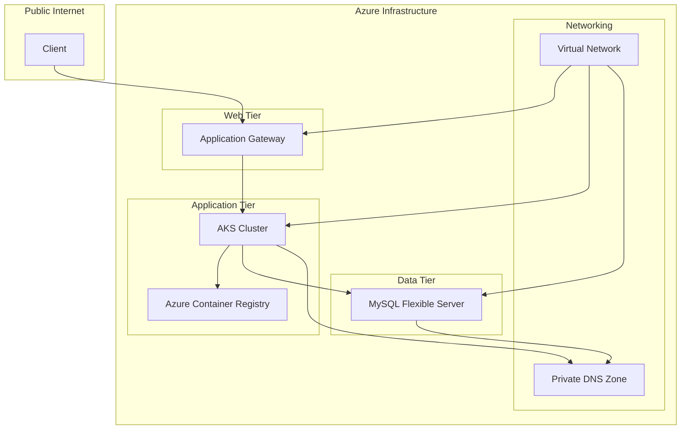

# Azure Three-Tier Application Infrastructure Demo

This example demonstrates a production-grade three-tier application infrastructure on Azure using Terraform. The infrastructure includes a web tier (Application Gateway), application tier (AKS), and data tier (MySQL Flexible Server) with proper networking and security configurations.

## Architecture Overview



## Infrastructure Components

1. **Networking**
   - Virtual Network with three subnets (web, app, db)
   - Network Security Groups
   - Private DNS Zone for database access

2. **Web Tier**
   - Application Gateway with WAF enabled
   - Public IP for external access
   - SSL/TLS termination

3. **Application Tier**
   - Azure Kubernetes Service (AKS)
   - Azure Container Registry (ACR)
   - System-assigned managed identity
   - Auto-scaling enabled

4. **Data Tier**
   - MySQL Flexible Server
   - Private access only
   - Automated backups
   - High availability configuration

## Prerequisites

- Azure CLI installed
- Terraform >= 1.0.0
- Azure subscription with appropriate permissions
- Service Principal with necessary permissions

## Usage

1. **Initialize Terraform**
   ```bash
   terraform init
   ```

2. **Review the Plan**
   ```bash
   terraform plan
   ```

3. **Apply the Infrastructure**
   ```bash
   terraform apply
   ```

4. **Destroy the Infrastructure**
   ```bash
   terraform destroy
   ```

## Variables

Key variables that can be customized:

- `environment`: Environment name (e.g., "prod", "dev")
- `location`: Azure region
- `cluster_name`: AKS cluster name
- `acr_name`: Azure Container Registry name
- `mysql_server_name`: MySQL server name
- `app_gateway_name`: Application Gateway name

## Outputs

The infrastructure provides the following outputs:

- `aks_cluster_name`: Name of the AKS cluster
- `aks_kube_config`: Kubernetes configuration
- `acr_login_server`: ACR login server URL
- `mysql_server_fqdn`: MySQL server FQDN
- `app_gateway_public_ip`: Application Gateway public IP

## Security Considerations

1. **Network Security**
   - Private subnets for application and database tiers
   - NSGs with minimal required rules
   - Private DNS for database access

2. **Access Control**
   - Managed identities for AKS
   - RBAC enabled on AKS
   - Private access for MySQL

3. **Data Protection**
   - SSL/TLS encryption
   - Automated backups
   - WAF protection

## Monitoring and Maintenance

1. **Monitoring**
   - Azure Monitor integration
   - Container insights enabled
   - Application Gateway metrics

2. **Maintenance**
   - Automated updates for AKS
   - Automated backups for MySQL
   - Rolling updates support

## Cost Optimization

1. **Resource Sizing**
   - Auto-scaling enabled
   - Appropriate VM sizes
   - Reserved instances available

2. **Storage**
   - Managed disks
   - Appropriate storage tiers

## Troubleshooting

Common issues and solutions:

1. **AKS Connection**
   ```bash
   az aks get-credentials --resource-group <resource_group> --name <cluster_name>
   ```

2. **Database Access**
   - Verify private DNS zone configuration
   - Check NSG rules
   - Validate MySQL firewall rules

3. **Application Gateway**
   - Check WAF rules
   - Verify SSL certificate
   - Review backend pool configuration

## Contributing

Please read [CONTRIBUTING.md](../../CONTRIBUTING.md) for details on our code of conduct and the process for submitting pull requests.

## License

This project is licensed under the MIT License - see the [LICENSE](../../LICENSE) file for details. 