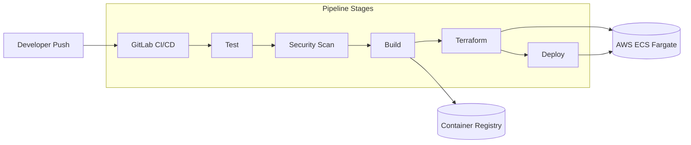
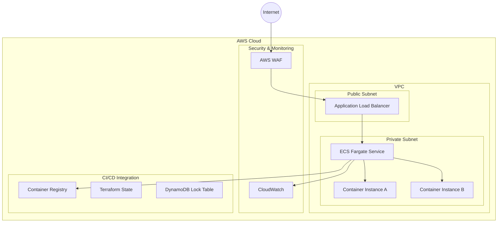
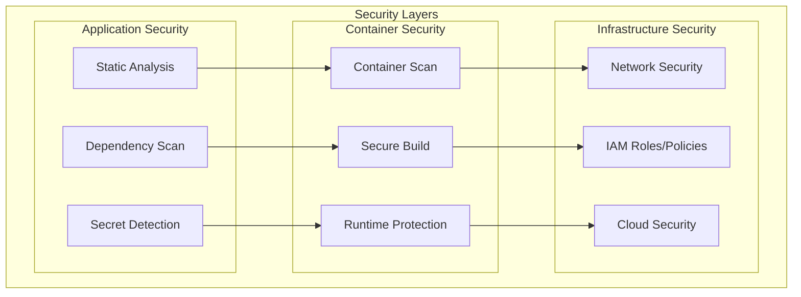
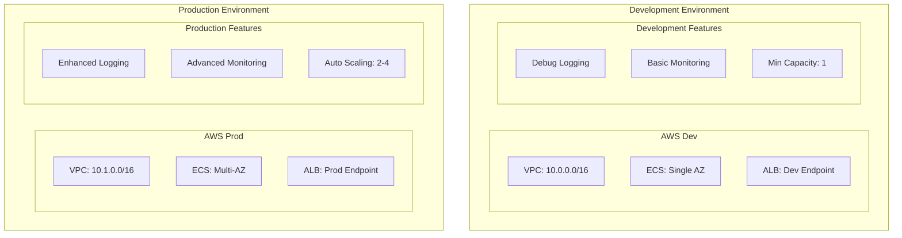
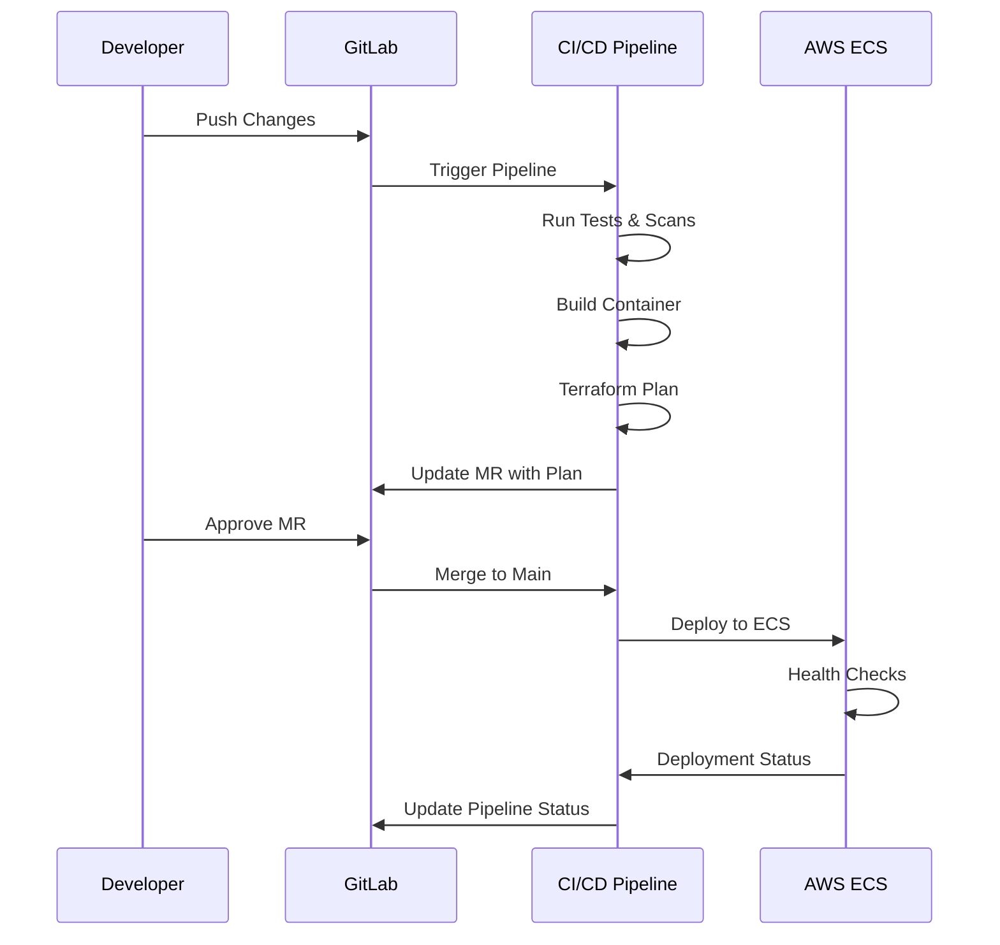

# GitLab DevSecOps Demo Project

This project demonstrates a complete CI/CD pipeline using GitLab with integrated security scanning for a containerized application deployed to AWS ECS Fargate using GitOps practices and Terraform.

## Architecture Overview

### CI/CD Pipeline Flow


### Infrastructure Architecture


### Security Implementation


## Documentation Index

- [Infrastructure Setup and Management](docs/infrastructure.md)
- [Security Implementation Guide](docs/security.md)
- [Pipeline Configuration and Usage](docs/pipeline.md)

## Project Overview

This demo implements:
- A simple static web application
- Docker containerization
- AWS ECS Fargate deployment
- Terraform infrastructure as code
- GitLab CI/CD pipeline with GitOps
- Comprehensive security scanning integration

## Quick Start

1. Clone this repository
2. Configure AWS credentials
3. Set up GitLab CI/CD variables:
   ```
   AWS_ACCESS_KEY_ID
   AWS_SECRET_ACCESS_KEY
   AWS_DEFAULT_REGION
   TF_STATE_BUCKET
   TF_LOCK_TABLE
   ```
4. Push to GitLab to trigger the pipeline

## Project Structure

```
.
├── src/                    # Application source code
├── terraform/              # Infrastructure as Code
│   ├── modules/           # Reusable Terraform modules
│   └── environments/      # Environment-specific configs
├── Dockerfile             # Container definition
├── docker-compose.yml     # Local development setup
├── .gitlab-ci.yml         # Pipeline configuration
└── docs/                  # Project documentation
```

## Development Workflow

1. Create feature branch
2. Make changes (application or infrastructure)
3. Commit and push to trigger pipeline
4. Review pipeline results:
   - Security scans
   - Infrastructure plans
   - Build status
5. Create merge request
6. After approval and merge, changes are automatically deployed

## Local Development

```bash
# Start local environment
docker-compose up -d

# Plan infrastructure changes
cd terraform/environments/dev
terraform init
terraform plan

# Access the application
http://localhost:8080
```

## Security Features

- Container scanning (Trivy)
- SAST (Static Application Security Testing)
- Dependency scanning
- Secret detection
- Infrastructure security scanning
- AWS security best practices

## Infrastructure Management

The project uses Terraform to manage:
- ECS Fargate cluster
- VPC and networking
- Security groups
- IAM roles and policies
- Auto-scaling configuration
- Load balancing

## Deployment Stages

1. Security Scanning
2. Build & Test
3. Infrastructure Validation
4. Deployment
5. Health Checks

## Solution Components

### 1. CI/CD Pipeline
- **Source Control**: GitLab Repository
- **Build**: Docker containerization
- **Security**: Multi-layer security scanning
- **Infrastructure**: Terraform-managed AWS resources
- **Deployment**: ECS Fargate with blue-green capability

### 2. AWS Infrastructure
- **Compute**: ECS Fargate for container orchestration
- **Networking**: VPC with public/private subnets
- **Security**: WAF, Security Groups, IAM roles
- **Monitoring**: CloudWatch integration
- **Storage**: S3 for Terraform state, ECR for containers

### 3. Security Measures
- **Application**: SAST, dependency scanning
- **Container**: Trivy scanner, minimal base images
- **Infrastructure**: AWS security best practices
- **Network**: Private subnets, WAF rules
- **CI/CD**: Secret detection, secure variables

### 4. GitOps Workflow
1. Code changes pushed to feature branch
2. Automated tests and security scans run
3. Infrastructure changes planned via Terraform
4. Changes reviewed in merge request
5. Automatic deployment on merge to main

## Environment Setup

### Development vs Production Architecture


### Resource Specifications

#### Development
- **Compute**: 
  - Task CPU: 256 (.25 vCPU)
  - Task Memory: 512MB
  - Desired Count: 1
- **Networking**:
  - Single Availability Zone
  - Public Subnet: 10.0.1.0/24
  - Private Subnet: 10.0.2.0/24

#### Production
- **Compute**:
  - Task CPU: 1024 (1 vCPU)
  - Task Memory: 2048MB
  - Desired Count: 2
- **Networking**:
  - Multi-AZ Setup
  - Public Subnets: 10.1.1.0/24, 10.1.2.0/24
  - Private Subnets: 10.1.3.0/24, 10.1.4.0/24

### Deployment Flow


## Contributing

1. Fork the repository
2. Create your feature branch
3. Commit your changes
4. Push to the branch
5. Create a new Merge Request

## License

MIT

## Support

For support, please check the documentation in the `docs/` directory or create an issue in the GitLab project.
