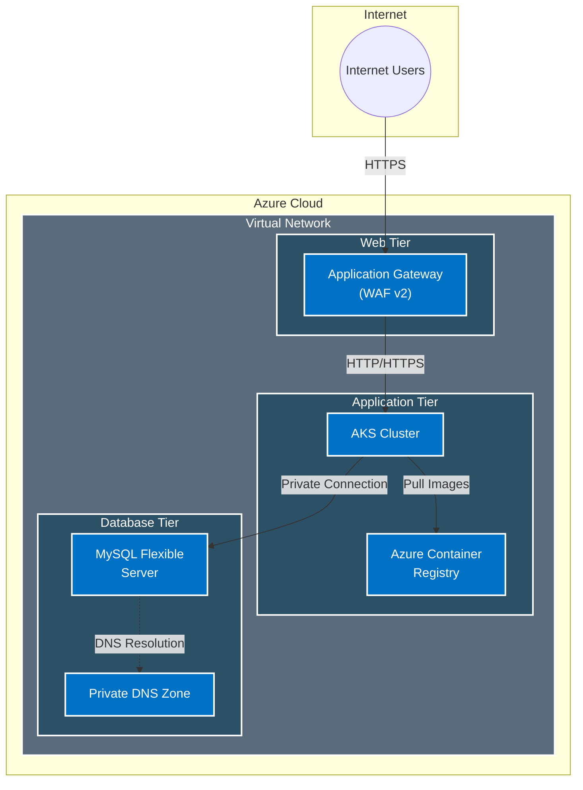

# Azure Three-Tier Application Infrastructure

This project implements a three-tier application architecture on Azure using Terraform. The architecture consists of web, application, and database tiers with proper network segmentation and security controls.

## Architecture Overview



## Network Architecture Details

### Virtual Network Configuration
- **Address Space**: `10.0.0.0/16`
- **Subnets**:
  1. Web Subnet (Application Gateway)
     - CIDR: `10.0.1.0/24`
     - NSG: Allows ports 80/443 inbound
  2. App Subnet (AKS)
     - CIDR: `10.0.2.0/24`
     - NSG: Allows internal traffic
  3. DB Subnet (MySQL)
     - CIDR: `10.0.3.0/24`
     - NSG: Allows only internal access

### Security Flow
1. **Internet Traffic**
   ```mermaid
   flowchart LR
       A[Internet] -->|WAF Protection| B[App Gateway] -->|TLS| C[AKS Pods]
   ```

2. **Application Flow**
   ```mermaid
   flowchart LR
       A[AKS Pods] -->|Pull| B[ACR]
       A -->|Private Link| C[MySQL]
   ```

3. **Private Connectivity**
   ```mermaid
   flowchart LR
       A[Services] -->|Query| B[Private DNS]
       B -->|Resolve| C[Private Endpoints]
   ```

## Components

1. **Network Module (`network`)**
   - Virtual Network with three subnets:
     - Web Subnet (Application Gateway)
     - App Subnet (AKS)
     - DB Subnet (MySQL)
   - Network Security Groups
   - Route Tables

2. **Application Gateway Module (`appgateway`)**
   - WAF v2 SKU
   - Public IP for external access
   - HTTP/HTTPS Listeners
   - Backend Pools targeting AKS
   - Health Probes for monitoring
   - SSL/TLS termination

3. **AKS Module (`aks`)**
   - Managed Kubernetes Cluster
   - System and User Node Pools
   - Auto-scaling (${var.min_count} to ${var.max_count} nodes)
   - CNI Networking
   - Managed Identity
   - Azure Monitor Integration

4. **MySQL Module (`mysql`)**
   - Azure Database for MySQL Flexible Server
   - Private Endpoint Connection
   - Automated Backups
   - High Availability Configuration
   - Firewall Rules
   - Performance Monitoring

5. **Private DNS Module (`private_dns`)**
   - Private DNS Zone for MySQL
   - Automatic Registration
   - Virtual Network Links
   - A Records for Services

6. **ACR Module (`acr`)**
   - Azure Container Registry (Premium SKU)
   - Geo-replication Ready
   - Private Link Support
   - Image Scanning
   - Webhook Integration

## Network Security

- Each tier is isolated in its own subnet
- Private endpoints for database access
- Application Gateway WAF protection
- Network Security Groups with proper rules
- Private DNS resolution

## Prerequisites

1. Azure Subscription
2. Azure CLI installed
3. Terraform installed (v1.0.0+)
4. Proper Azure permissions

## Usage

1. Initialize Terraform:
```bash
terraform init
```

2. Review the plan:
```bash
terraform plan
```

3. Apply the configuration:
```bash
terraform apply
```

## Variables

Key variables that need to be configured:

- `resource_group_name`: Name of the resource group
- `location`: Azure region
- `environment`: Environment name (e.g., dev, prod)
- `address_space`: VNet address space
- `mysql_administrator_password`: MySQL admin password
- `kubernetes_version`: AKS version

## Outputs

- `aks_cluster_name`: Name of the AKS cluster
- `acr_login_server`: ACR login server URL
- `mysql_server_fqdn`: MySQL server FQDN
- `application_gateway_ip`: Application Gateway public IP

## Security Considerations

1. Network Security:
   - Subnets are isolated
   - NSGs control traffic flow
   - Private endpoints for services

2. Access Control:
   - RBAC enabled on AKS
   - MySQL uses private endpoints
   - ACR with admin access disabled

3. Monitoring:
   - Azure Monitor integration
   - Log Analytics workspace
   - Container insights

## Cost Optimization

- Auto-scaling enabled for AKS
- Proper SKU selection for services
- Resource tagging for cost allocation

## Maintenance

1. Regular Updates:
   - AKS version upgrades
   - Security patches
   - Infrastructure updates

2. Backup Strategy:
   - MySQL automated backups
   - AKS state backup
   - Infrastructure state backup

## Contributing

1. Fork the repository
2. Create a feature branch
3. Submit a pull request

## License

This project is licensed under the MIT License. 