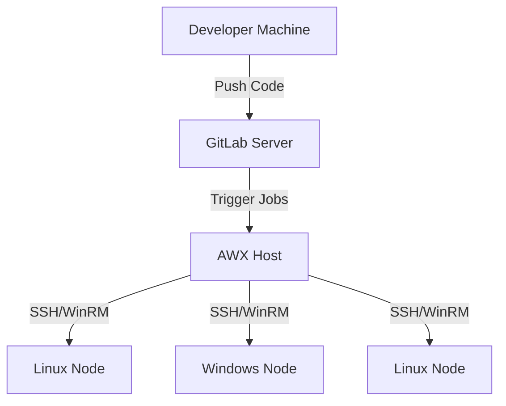

# Centralized Ansible Automation with AWX and GitLab CI/CD

## 🏗️ Project Architecture



## 📋 Prerequisites

### Hardware Requirements
- 4-6 Virtual Machines (VMs) with the following specifications:
  - 4 vCPUs
  - 8GB RAM
  - 50GB Storage
  - Network connectivity between all nodes

### Software Requirements
1. **GitLab Server** (Ubuntu 24.04 or RHEL 9)
   - 4 vCPUs
   - 8GB RAM
   - 50GB Storage

2. **AWX Host** (Ubuntu 24.04 or RHEL 9)
   - 4 vCPUs
   - 8GB RAM
   - 50GB Storage
   - Docker/Podman support

3. **Target Nodes**
   - 2+ Linux nodes (Ubuntu 24.04 or RHEL 9)
   - 1 Windows node (Windows Server 2022)
   - 2 vCPUs
   - 4GB RAM
   - 20GB Storage each

## 🚀 Installation Steps

### 1. GitLab Server Setup
```bash
# For Ubuntu 24.04
sudo apt update
sudo apt install -y curl openssh-server ca-certificates postfix
curl -sS https://packages.gitlab.com/install/repositories/gitlab/gitlab-ce/script.deb.sh | sudo bash
sudo apt install gitlab-ce

# For RHEL 9
sudo dnf install -y curl policycoreutils openssh-server postfix
curl -sS https://packages.gitlab.com/install/repositories/gitlab/gitlab-ce/script.rpm.sh | sudo bash
sudo dnf install gitlab-ce
```

### 2. AWX Host Setup
```bash
# Install required packages
sudo dnf install -y git ansible podman docker-compose python3-pip

# Install AWX Operator
git clone https://github.com/ansible/awx-operator.git
cd awx-operator
git checkout 2.9.0
export NAMESPACE=awx
make deploy

# Create AWX instance
kubectl apply -f awx-deploy.yml
```

### 3. Target Nodes Setup
```bash
# For Linux nodes
sudo apt update  # Ubuntu
sudo dnf update  # RHEL

# For Windows node
# Install OpenSSH Server
Add-WindowsCapability -Online -Name OpenSSH.Server~~~~0.0.1.0
Start-Service sshd
Set-Service -Name sshd -StartupType 'Automatic'
```

## 📁 Project Structure
```
ansible-lab/
├── roles/
│   ├── webserver/
│   │   ├── tasks/
│   │   ├── handlers/
│   │   ├── templates/
│   │   └── vars/
│   └── common/
│       ├── tasks/
│       └── handlers/
├── playbooks/
│   ├── site.yml
│   ├── patch.yml
│   └── compliance.yml
├── inventories/
│   ├── dev/
│   │   └── hosts.yml
│   └── prod/
│       └── hosts.yml
├── group_vars/
│   ├── all.yml
│   └── webservers.yml
├── vault/
│   └── secrets.yml
└── .gitlab-ci.yml
```

## 🔧 Configuration Steps

### 1. GitLab Configuration
1. Access GitLab web interface (http://your-gitlab-server)
2. Create new project
3. Configure CI/CD variables:
   - `ANSIBLE_VAULT_PASSWORD`
   - `SSH_PRIVATE_KEY`
   - `WINRM_PASSWORD`

### 2. AWX Configuration
1. Access AWX web interface (http://your-awx-server)
2. Create credentials:
   - SSH private key
   - Windows credentials
   - Vault password
3. Create inventory
4. Create job templates
5. Configure webhooks

### 3. Ansible Configuration
1. Create inventory files
2. Set up vault for secrets
3. Create playbooks and roles
4. Configure CI/CD pipeline

## 🔄 Workflow

1. **Development**
   - Developer creates/updates Ansible code
   - Code is pushed to GitLab
   - CI pipeline runs linting and testing

2. **Deployment**
   - GitLab triggers AWX via webhook
   - AWX executes job template
   - Changes are applied to target nodes

3. **Monitoring**
   - AWX provides job status and logs
   - GitLab shows pipeline status
   - Target nodes report back status

## 🧪 Testing Scenarios

1. **Basic Web Server Setup**
   ```bash
   ansible-playbook playbooks/site.yml -i inventories/dev/hosts.yml --tags webserver
   ```

2. **Patching**
   ```bash
   ansible-playbook playbooks/patch.yml -i inventories/prod/hosts.yml
   ```

3. **Compliance Check**
   ```bash
   ansible-playbook playbooks/compliance.yml -i inventories/prod/hosts.yml
   ```

## 🔐 Security Considerations

1. **Secrets Management**
   - Use Ansible Vault for sensitive data
   - Rotate vault password regularly
   - Limit access to vault files

2. **Access Control**
   - Implement RBAC in AWX
   - Use SSH keys for Linux nodes
   - Secure WinRM for Windows nodes

3. **Network Security**
   - Use firewalls between components
   - Implement VPN for remote access
   - Monitor network traffic

## 📈 Monitoring and Maintenance

1. **Regular Tasks**
   - Update AWX and dependencies
   - Rotate credentials
   - Backup configurations
   - Review logs and metrics

2. **Troubleshooting**
   - Check AWX job logs
   - Verify target node connectivity
   - Review GitLab pipeline status

## 🤝 Support and Resources

- [Ansible Documentation](https://docs.ansible.com)
- [AWX Documentation](https://github.com/ansible/awx)
- [GitLab CI/CD Documentation](https://docs.gitlab.com/ee/ci/)
- [Project Issues](https://github.com/your-repo/issues)

## 📝 License

This project is licensed under the MIT License - see the [LICENSE](LICENSE) file for details. 